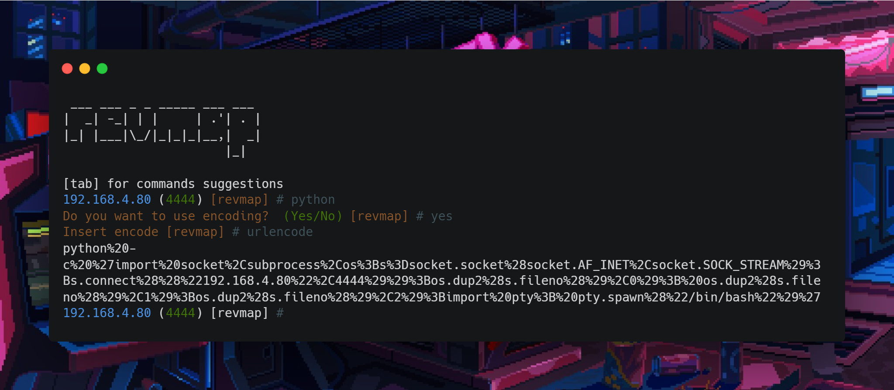

<p align="center">
	<a href="https://www.python.org/"></a>
	<a href="#"></a>
	<a href="https://github.com/joaoviictorti/revmap/releases"></a>
</p>

<h4 align="center">Tool that generates reverse shell in various programming languages and codes</h4>


<p align="center">
  <a href="#features">Features</a> •
  <a href="#installation">Installation</a> •
  <a href="#how-to-use"> How to use</a> •
  <a href="#details">Details</a> •
  <a href="#running-revmap">Running revmap</a>  
</p>

---


revmap is a tool that generates reverse shell payloads for various languages such as python, bash, perl, powershell and many others. It has a feature that encodes the desired payloads, making it simple and optimized for speed. Revmap is built to do just one thing: generate reverse shell payloads + encodes and it does it very well.

I designed `revmap` to fulfill all the responsibilities for generating payloads and encodes, maintaining a consistently passive model to make it useful for penetration testers.

# Features

 - Gera payloads de reverse shell para diversas linguagens de programação (python, bash, powershell e etc)
 - Funcionalidade de realizar encode das payloads desejadas (Url encode, base64, hexadecimal e etc)

# How to use

```sh
revmap --ip 192.168.4.80 --port 4444 --payload bash --encode urlencode
revmap --ip 192.168.4.80 --port 4444 --payload bash 
revmap --ip 192.168.4.80 --port 4444 --payload python
revmap --ip 192.168.4.80 --port 4444 --payload perl --encode base64
```
# Details


# Installation

revmap requires **python3** and to download it just use:

```sh
pip3 install revmap
```

# Running revmap



