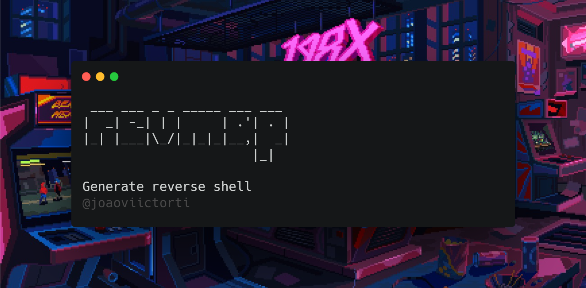
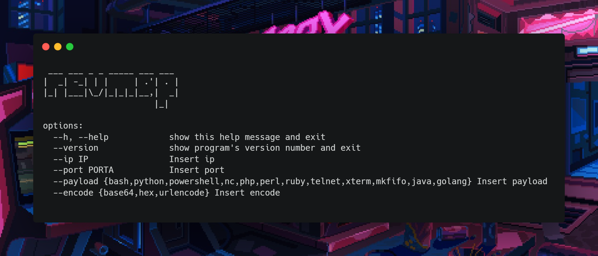
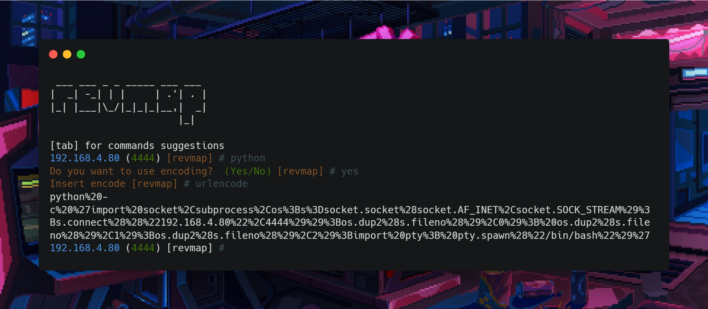

{.center}

<p align="center">
	<a href="https://www.python.org/"></a>
	<a href="#"></a>
	<a href="https://github.com/joaoviictorti/revmap/releases"></a>
</p>

<h4 align="center">Ferramenta que gera shell reverso em várias linguagens de programação e codifica</h4>

<p align="center">
  <a href="#características">Características</a> •
  <a href="#instalação">Instalação</a> •
  <a href="#forma-de-utilização"> Forma de utilização</a> •
  <a href="#executando-revmap">Executando revmap</a>
</p>

---


O revmap é uma ferramenta que gera payloads de reverse shell de várias linguagens como python, bash, perl, powershell e muit outros. Possui uma funcionalidade que faz encode das payloads desejadas e dessa forma sendo simples e otimizada para velocidade. Revmap é construído para fazer apenas uma coisa: gera payloads reverse shell + encodes e faz isso muito bem.

Projetei o `revmap` para cumprir todas as responsabilidades para gera payloads e encodes, mantive um modelo consistentemente passivo para torná-lo útil para testadores de penetração.

# Características

 - Gera payloads de reverse shell para diversas linguagens de programação (python, bash, powershell e etc)
 - Funcionalidade de realizar encode das payloads desejadas (Url encode, base64, hexadecimal e etc)

# Forma de utilização

```sh
revmap --ip 192.168.4.80 --port 4444 --payload bash --encode urlencode
revmap --ip 192.168.4.80 --port 4444 --payload bash 
revmap --ip 192.168.4.80 --port 4444 --payload python
revmap --ip 192.168.4.80 --port 4444 --payload perl --encode base64
```
# Detalhes



# Instalação

revmap requer **python3** e para baixá-lo só usar:

```sh
pip3 install revmap
```

# Executando revmap




